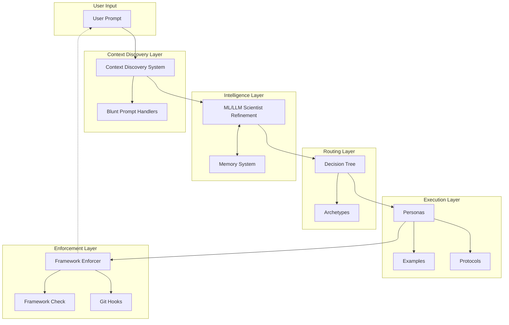
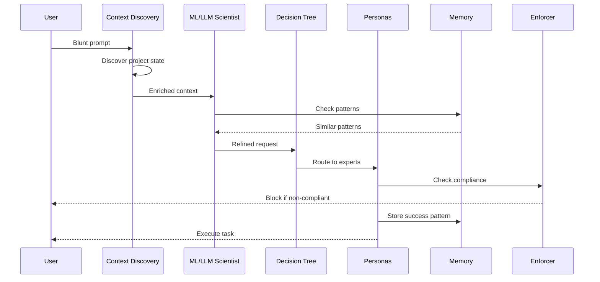
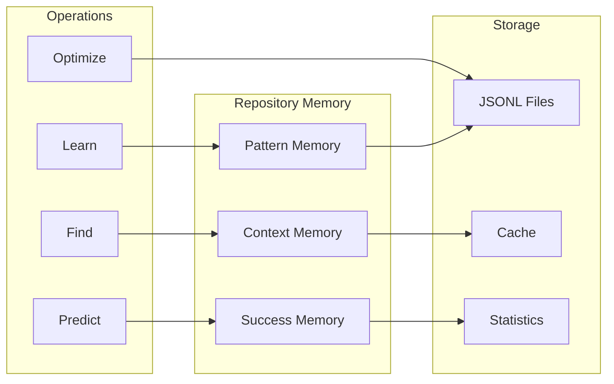
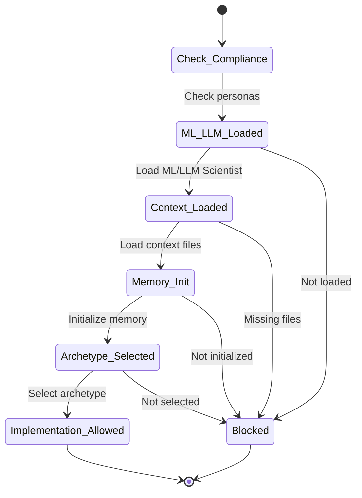
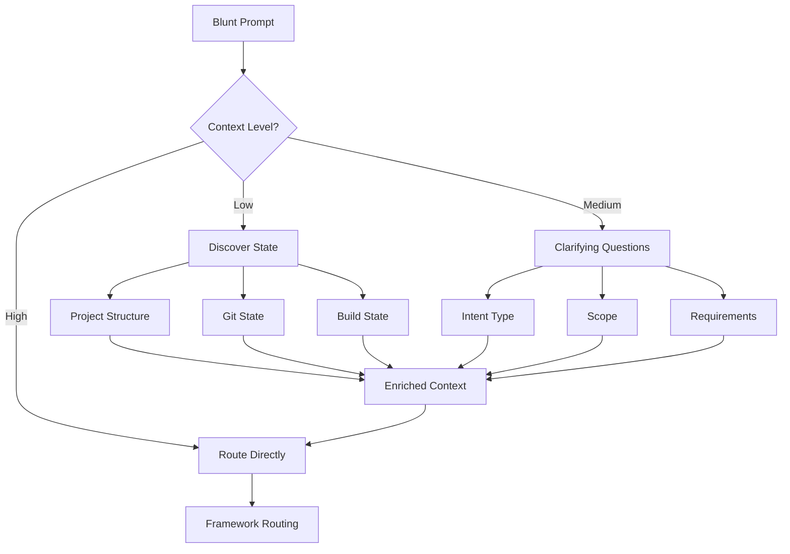
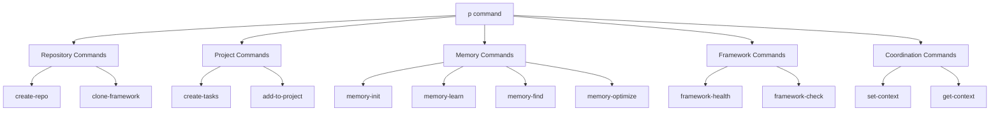
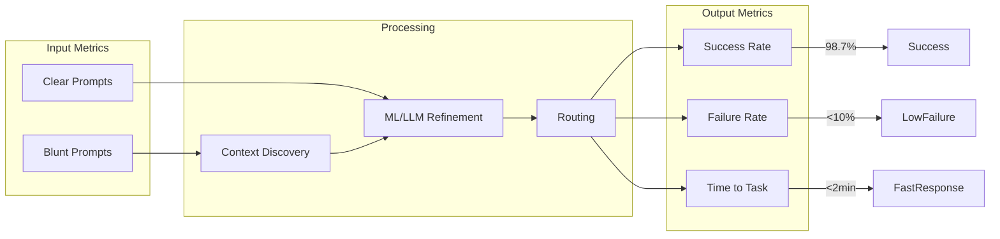
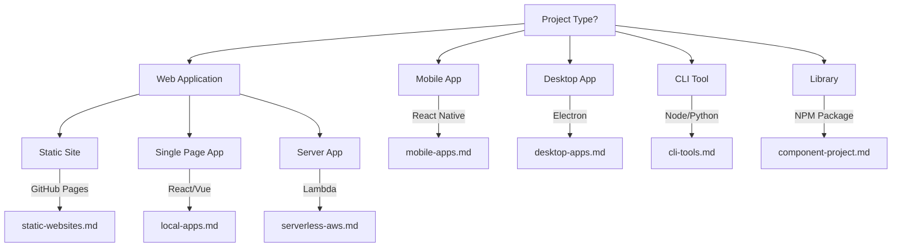
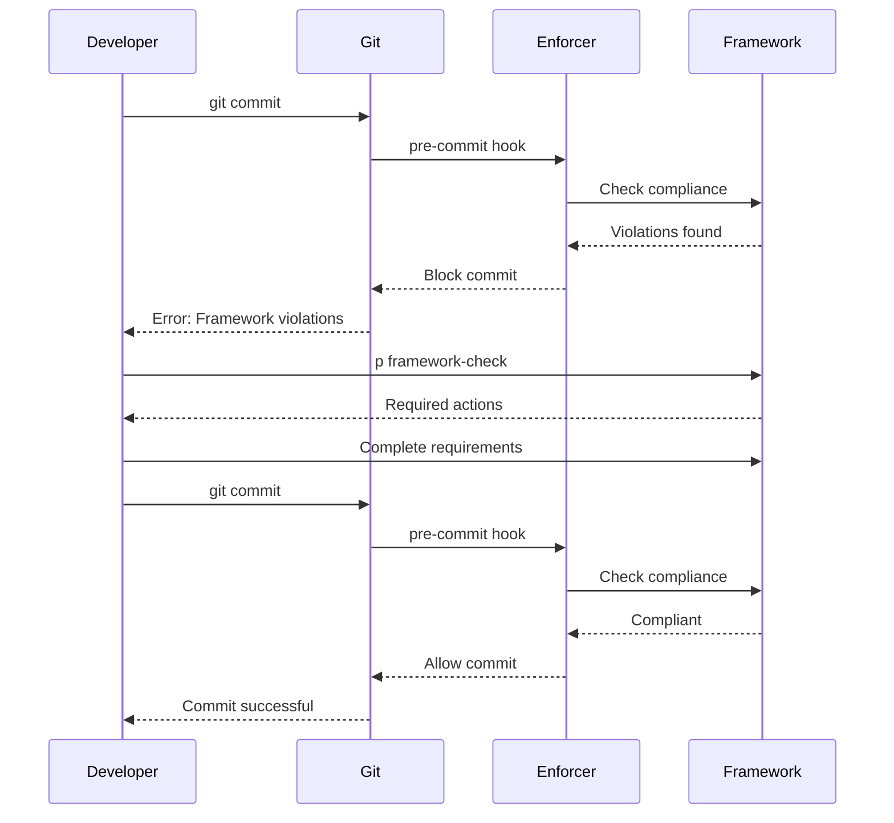

# CLAUDE Framework Architecture

## System Overview

## Component Flow

## Memory System Architecture

## Framework Compliance Flow

## Blunt Prompt Resolution

## P-CLI Command Structure

## Success Metrics Flow

## Archetype Selection Tree

## Enforcement Mechanism

