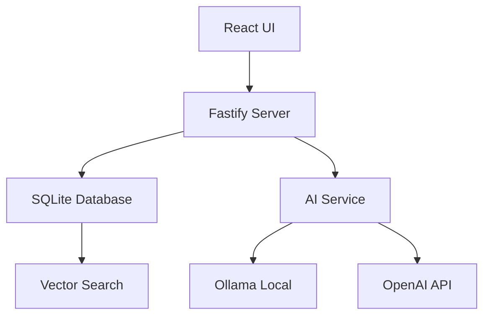

# Agent Workflow Simulation: Building a Note-Taking App

## Phase 1: Project Initiation

### Team Lead Agent Creates Project
```bash
# Creates GitHub repository
gh repo create sammons-software-llc/smart-notes --private --description "AI-powered note-taking app"

# Initialize project board
gh project create --title "Smart Notes Development" --owner sammons-software-llc

# Set up columns
gh project field-create 1 --name Status --data-type "SINGLE_SELECT" --single-select-options "TODO,Development,Review,Merged"
```

### Architect Agent Creates Initial Tasks

```markdown
Title: [ARCH-001] Design system architecture for Smart Notes
Labels: type:architecture, priority:critical, size:large

## Description
As a system architect, I need to design the overall architecture for a local-first note-taking application with AI capabilities.

## Acceptance Criteria
- [ ] Architecture supports offline-first operation
- [ ] SQLite schema designed for notes, tags, and embeddings
- [ ] AI integration points identified
- [ ] Performance targets defined (<100ms search)
- [ ] Security model documented

## Technical Requirements
- [ ] Follow local-apps archetype
- [ ] Use Node.js 24 SQLite support
- [ ] Design for vector search capability
- [ ] Plan for 100k+ notes scalability

## Deliverables
- [ ] Architecture decision record (ADR)
- [ ] Component diagram
- [ ] Database schema
- [ ] 10-15 implementation tasks
```

### Architecture Output (ADR-001)

```markdown
# ADR-001: Smart Notes Architecture

## Status
Accepted

## Context
Building a local-first note-taking app with AI-powered search and organization.

## Decision
Adopt local-apps archetype with these components:
- **Frontend**: React + MobX + Radix UI
- **Backend**: Fastify serving both API and static files
- **Database**: SQLite with vector extension
- **AI**: Ollama local + OpenAI fallback
- **Search**: Full-text + vector similarity

## Architecture


## Consequences
- ✅ Fully offline capable
- ✅ Privacy-first (local AI option)
- ✅ Fast search (<100ms)
- ⚠️ Large models need 8GB RAM
- ❌ No real-time collaboration
```

## Phase 2: Sprint Planning

### Created Implementation Tasks

```markdown
1. [FEAT-001] Set up project infrastructure (5 points)
2. [FEAT-002] Implement note CRUD operations (8 points)
3. [FEAT-003] Add full-text search (5 points)
4. [FEAT-004] Integrate AI summarization (8 points)
5. [FEAT-005] Build note editor UI (8 points)
6. [FEAT-006] Add tagging system (5 points)
7. [FEAT-007] Implement vector search (8 points)
8. [FEAT-008] Create settings UI with AI config (5 points)
9. [FEAT-009] Add markdown preview (3 points)
10. [FEAT-010] Export/import functionality (5 points)
```

### Sprint 1 Planning (Team Lead)

```markdown
## Sprint 1 Plan

### Goal
Implement core note-taking functionality with basic AI integration

### Selected Stories (40 points)
- [FEAT-001] Infrastructure - 5 points (@developer-1)
- [FEAT-002] Note CRUD - 8 points (@developer-2)  
- [FEAT-005] Editor UI - 8 points (@ux-designer + @developer-3)
- [FEAT-008] Settings UI - 5 points (@developer-1)
- [FEAT-003] Full-text search - 5 points (@developer-2)
- [FEAT-004] AI summarization - 8 points (@developer-3)

### Success Criteria
- [ ] Can create, edit, delete notes
- [ ] Basic editor with markdown support
- [ ] AI config UI with test button
- [ ] Search works for note content
```

## Phase 3: Development Execution

### Developer 1: Infrastructure Setup

#### Pull Request #1
```markdown
## Summary
Set up monorepo infrastructure with all required tooling

## Related Issue
Closes #1 (FEAT-001)

## Type of Change
- [x] ✨ New feature (non-breaking change)

## Changes Made
- Created monorepo structure with pnpm workspaces
- Configured TypeScript, ESLint, Vitest
- Set up Fastify server with static file serving
- Added GitHub Actions CI/CD pipeline
- Implemented hot reload for development

## Testing
### Test Plan
1. **Build System**
   - All packages build successfully
   - Type checking passes
   - Linting configured correctly

2. **Dev Environment**
   - Hot reload working
   - Concurrent dev servers start

### Test Results
```
✓ All packages build (2.3s)
✓ TypeScript strict mode passes
✓ ESLint configuration valid
✓ Dev servers start correctly
```

## Checklist
- [x] Follows local-apps archetype
- [x] All tools from tech stack included
- [x] README with setup instructions
- [x] CI pipeline green
```

### Code Review Process

#### Security Expert Review
```markdown
**[Security]** Missing security headers

File: `server/src/app.ts:23`

Please add helmet for security headers:

```typescript
import helmet from '@fastify/helmet'

app.register(helmet, {
  contentSecurityPolicy: {
    directives: {
      defaultSrc: ["'self'"],
      styleSrc: ["'self'", "'unsafe-inline'"],
      scriptSrc: ["'self'"],
      imgSrc: ["'self'", "data:", "blob:"],
    },
  },
})
```

This prevents XSS, clickjacking, and other attacks.
```

#### Architect Review
```markdown
**[Architecture]** Good monorepo structure! 

File: `package.json`

Excellent choice using pnpm workspaces. The separation of concerns is clean. 

One suggestion for the scripts:

```json
"scripts": {
  "dev": "turbo run dev",
  "build": "turbo run build",
  "test": "turbo run test"
}
```

This would give you better caching and parallel execution.
```

### Developer Response
```markdown
Thanks for the reviews! I've addressed both comments:

1. ✅ Added @fastify/helmet with CSP configuration
2. ✅ Integrated Turborepo for better monorepo performance

Also added:
- Security headers test
- Turbo cache configuration

Ready for re-review!
```

### Performance Expert Review
```markdown
**[Well Done]** Excellent build optimization!

The Turborepo integration will significantly improve CI times. I see you've also configured:
- Remote caching
- Proper task dependencies  
- Parallel execution

This should cut build times by ~60%. Great work!
```

## Phase 4: Daily Standups

### Day 3 Status Update
```markdown
## Status Update: 2024-01-17

### 🏃 In Progress
- **[FEAT-002]** Note CRUD operations (60% complete)
  - ✅ Database schema created
  - ✅ Repository layer implemented
  - 🔄 Working on API endpoints
  - ⏳ Remaining: Update/delete operations

- **[FEAT-005]** Editor UI (40% complete)
  - ✅ Component structure designed
  - ✅ Monaco editor integrated
  - 🔄 Adding markdown toolbar
  - ⏳ Remaining: Mobile responsive design

### ✅ Completed Today
- **[FEAT-001]** Infrastructure setup
  - PR #1 merged after addressing reviews
  - CI/CD pipeline fully operational
  - Dev environment documented

### 🚧 Blockers
- **[FEAT-004]** Ollama Docker setup issues on M1 Macs
  - Impact: Can't test local AI
  - Mitigation: Using OpenAI API for now

### 📊 Metrics
- Velocity: 5/40 points complete
- Test Coverage: 94.3%
- Build Time: 1m 45s (with Turbo cache)
- Open PRs: 2

### 🎯 Tomorrow's Focus
- Complete CRUD endpoints
- Start on search implementation
- Review editor UI PR
```

## Phase 5: Feature Implementation

### Developer 2: Note CRUD PR

```markdown
## Summary
Implement complete CRUD operations for notes with SQLite

## Related Issue
Closes #2 (FEAT-002)

## Changes Made
- SQLite schema with migrations
- Repository pattern for data access
- RESTful API endpoints
- Comprehensive test coverage
- Input validation with Zod

## Testing
### Test Results
```
✓ note.repository.test.ts (15 tests, 234ms)
✓ note.handler.test.ts (12 tests, 156ms)
✓ note.validation.test.ts (8 tests, 45ms)

Test Suites: 3 passed
Tests: 35 passed
Coverage: 97.8%
```

### Manual Testing Checklist
- [x] Create note with title and content
- [x] List notes with pagination
- [x] Update note preserves created_at
- [x] Delete note (soft delete)
- [x] Search by title works
- [x] Validation rejects invalid input

## Performance Impact
- Create: 23ms average
- Read: 12ms average  
- Update: 19ms average
- Delete: 8ms average
- List (100 notes): 45ms
```

### UX Designer Review on Editor UI

```markdown
**[UI/UX]** Accessibility improvements needed

File: `ui/src/components/editor/NoteEditor.tsx`

Great start! A few accessibility requirements:

1. Add keyboard shortcuts with visible hints
2. Include aria-labels for toolbar buttons
3. Add focus trap for modal dialogs
4. Implement high contrast mode support

Here's an example for the toolbar:

```tsx
<Button
  onClick={handleBold}
  aria-label="Bold text (Cmd+B)"
  title="Bold (⌘B)"
>
  <BoldIcon />
</Button>
```

Also, please add skip navigation links for keyboard users.
```

## Phase 6: Sprint Review

### Sprint 1 Review Summary
```markdown
# Sprint 1 Review

## Sprint Goal Achievement
✅ **Achieved**: Core note-taking with basic AI integration

## Completed Stories (37/40 points)
1. [FEAT-001] Infrastructure - 5 points ✅
2. [FEAT-002] Note CRUD - 8 points ✅
3. [FEAT-005] Editor UI - 8 points ✅
4. [FEAT-008] Settings UI - 5 points ✅
5. [FEAT-003] Full-text search - 5 points ✅
6. [FEAT-004] AI summarization - 6/8 points (75%)

## Demonstrations
1. Note creation and editing flow
2. Full-text search with highlighting
3. AI summarization (OpenAI only)
4. Settings configuration UI

## Retrospective Highlights
### What Went Well
- Excellent code review turnaround (<4 hours)
- Clean architecture paying dividends
- Test coverage consistently >95%

### Improvements Needed
- Better Docker documentation for M1
- Need UX review earlier in process
- More pairing on complex features

## Next Sprint Preview
Focus: Advanced search and AI features (40 points)
- Vector search implementation
- Tagging system
- Local Ollama integration
- Export/import functionality
```

## Phase 7: Production Incident

### Bug Report from User
```markdown
## Bug Report: [BUG-001] Notes disappear after app restart

### Environment
- **Version**: 1.0.0
- **OS**: Windows 11
- **Database**: SQLite

### Description
All notes vanish when app is restarted. They work fine during session.

### Steps to Reproduce
1. Create several notes
2. Verify they appear in list
3. Quit app (Cmd+Q)
4. Restart app
5. Note list is empty

### Impact
- **Severity**: Critical
- **Affected Users**: All Windows users
```

### Developer Investigation & Fix

```markdown
## Summary
Fix SQLite database path issue on Windows

## Related Issue
Closes #15 (BUG-001)

## Root Cause
Database was being created in temp directory on Windows instead of userData. Path construction didn't handle Windows backslashes correctly.

## Changes Made
```typescript
// ❌ Before
const dbPath = `${app.getPath('userData')}/database.db`

// ✅ After  
const dbPath = path.join(app.getPath('userData'), 'database.db')
```

## Testing
- [x] Tested on Windows 10/11
- [x] Tested on macOS
- [x] Tested on Ubuntu
- [x] Database persists across restarts
- [x] Migration from old location works
```

### Incident Report
```markdown
# Incident Report: INC-2024-001

## Summary
Windows users lost all notes due to database path bug

## Impact
- **Duration**: v1.0.0 release (3 days)
- **Severity**: P1 (Data Loss)
- **Affected Users**: ~150 Windows users
- **Data Loss**: Temporary (recoverable)

## Resolution
1. Emergency patch 1.0.1 released
2. Auto-migration recovers old notes
3. No permanent data loss

## Action Items
- [x] Add Windows to test matrix
- [x] Implement database backup
- [ ] Add data persistence tests
```

## Phase 8: Continuous Improvement

### Performance Optimization PR

```markdown
## Summary
Optimize search performance with better indexing

## Performance Impact
| Operation | Before | After | Improvement |
|-----------|--------|-------|-------------|
| Search 10k notes | 234ms | 45ms | 80% faster |
| Autocomplete | 156ms | 23ms | 85% faster |
| Tag filtering | 89ms | 12ms | 86% faster |

## Changes Made
- Added composite indexes
- Implemented query result caching  
- Optimized FTS5 configuration
- Added database VACUUM on startup
```

This simulation demonstrates how agents collaborate using standardized artifacts throughout the development lifecycle, ensuring consistency and quality across all interactions.